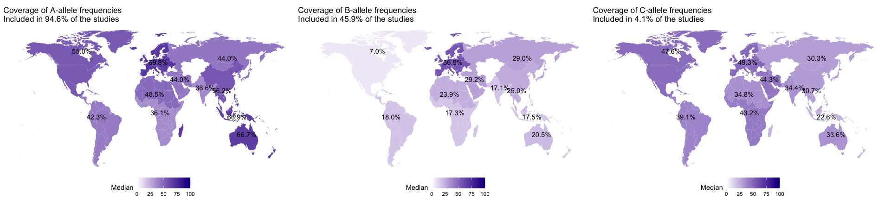

-   [Load](#load)
-   [Import data](#import-data)
    -   [Removed papers](#removed-papers)
    -   [Frequency others](#frequency-others)
    -   [Most frequent across Europe](#most-frequent-across-europe)
    -   [High fraction has missing % of the
        allele](#high-fraction-has-missing-of-the-allele)
    -   [All on top](#all-on-top)
        -   [Easier comparison](#easier-comparison)
    -   [Table per allele](#table-per-allele)
    -   [Calculate ratios](#calculate-ratios)
    -   [Plot MHC median vs ratio](#plot-mhc-median-vs-ratio)
    -   [Worldmap plots](#worldmap-plots)
    -   [Overall frequency across the
        world](#overall-frequency-across-the-world)
    -   [Country specific](#country-specific)
    -   [Maps](#maps)

## Load

    library(ggplot2)
    library(magrittr)
    library(tidyverse)

    ## ── Attaching core tidyverse packages ──────────────────────── tidyverse 2.0.0 ──
    ## ✔ dplyr     1.1.4     ✔ readr     2.1.5
    ## ✔ forcats   1.0.0     ✔ stringr   1.5.1
    ## ✔ lubridate 1.9.3     ✔ tibble    3.2.1
    ## ✔ purrr     1.0.2     ✔ tidyr     1.3.1
    ## ── Conflicts ────────────────────────────────────────── tidyverse_conflicts() ──
    ## ✖ tidyr::extract()   masks magrittr::extract()
    ## ✖ dplyr::filter()    masks stats::filter()
    ## ✖ dplyr::lag()       masks stats::lag()
    ## ✖ purrr::set_names() masks magrittr::set_names()
    ## ℹ Use the conflicted package (<http://conflicted.r-lib.org/>) to force all conflicts to become errors

    library(patchwork)
    library(tidytext)
    source("Utils.R")

# Import data

    alleletop <- rio::import("./Data/Alleles_MostFreq_Continents.xlsx")
    alleletop$Allele <- paste0(alleletop$HLA, "*", alleletop$Name)
    studyids <- rio::import("./Data/StudyIDs.xlsx")

## Removed papers

    RemovedDatabase <- rio::import("./Data/Database_removed.xlsx")
    Database <- rio::import("./Data/Database_HLA.xlsx")

    nrow(RemovedDatabase)+nrow(Database)

    ## [1] 615

    RemovedDatabase <- RemovedDatabase[-which(RemovedDatabase$No_English == 1),]
    RemovedDatabase <- RemovedDatabase[-which(RemovedDatabase$Not_COVID == 1),]
    RemovedDatabase <- RemovedDatabase[!RemovedDatabase$Item_type %in% "Report",]
    RemovedDatabase <- RemovedDatabase[which(is.na(RemovedDatabase$Item_type) | RemovedDatabase$Item_type %in% "Journal Article"),]
    RemovedDatabase <- RemovedDatabase[!RemovedDatabase$Related_topic %in% 1,]

## Frequency others

    table(Database$Sum)

    ## 
    ##  1  2  3  4  5  6  7  8 10 11 
    ## 33  9  7  6  5  6  2  4  1  1

    Database[is.na(Database)] <- 0

    dx <- colSums(Database[,13:ncol(Database)])
    dx <- data.frame(HLA = names(dx), Freq=dx)
    dx <- dx[order(dx$Freq, decreasing = T),]
    dx$Ratio <- dx$Freq / nrow(Database)

    dx$HLA <- factor(dx$HLA, levels=dx$HLA[order(dx$Freq,decreasing = T)])

## Most frequent across Europe

    freqs.all <- lapply(1:nrow(alleletop),getFrequencySpecific, data.in=alleletop) %>% do.call(what=rbind)
    save(alleletop, freqs.all, file="./Data/freqs.all.RData")

    load("./Data/freqs.all.RData")

## High fraction has missing % of the allele

    table(freqs.all$`Allele Frequency` == "")

    ## 
    ## FALSE  TRUE 
    ##  9534    85

    table(freqs.all$`% of individuals that have the allele` == "")

    ## 
    ## FALSE  TRUE 
    ##  3083  6536

    freqs.all <- freqs.all[freqs.all$AlleleFrequency !=0,]
    freqs.all <- freqs.all[freqs.all$Allele %in% alleletop$Allele,]
    data.median.all <- freqs.all %>%
      group_by(Region, Allele) %>%
      summarise(Median = median(AlleleFrequency, na.rm=T))

    ## `summarise()` has grouped output by 'Region'. You can override using the
    ## `.groups` argument.

## All on top

    data.median.all$Alleles <- substr(data.median.all$Allele, 1,1)
    data.median.all$Included <- ifelse(data.median.all$Allele %in% gsub("HLA-","",dx$HLA), "*",NA)

    data.median.all$Frequency <- dx[match(data.median.all$Allele, gsub("HLA-","",dx$HLA)),"Freq"]

    ggplot(data.median.all,aes(x=reorder_within(Allele, 1-Median, Region), y=Median, fill=Alleles))+
      facet_wrap(~Region, scale="free_x")+
      geom_col()+
      geom_text(aes(x=reorder_within(Allele, 1-Median, Region), y=Median+0.05, label=Frequency))+
      scale_x_reordered()+
      theme(axis.text.x=element_text(angle=90, vjust=0.3, hjust=1))+
      scale_fill_manual(values = MetBrewer::met.brewer("Cassatt1",3))+
      xlab("Alelle")+
      ylab("Median frequency")

    ## Warning: Removed 188 rows containing missing values or values outside the scale range
    ## (`geom_text()`).

    data.median.all.A <- data.median.all[grep("A\\*",data.median.all$Allele),]
    data.median.all.B <- data.median.all[grep("B\\*",data.median.all$Allele),]
    data.median.all.C <- data.median.all[grep("C\\*",data.median.all$Allele),]

    ggplot(data.median.all.A,aes(x=reorder_within(Allele, 1-Median, Region), y=Median))+
      facet_grid(~Region, scale="free_x")+
      geom_col()+
      scale_x_reordered()+
      theme(axis.text.x=element_text(angle=90, vjust=0.3, hjust=1))+
      ggplot(data.median.all.B,aes(x=reorder_within(Allele, 1-Median, Region), y=Median))+
      facet_grid(~Region, scale="free_x")+
      geom_col()+
      scale_x_reordered()+
      theme(axis.text.x=element_text(angle=90, vjust=0.3, hjust=1))+
      ggplot(data.median.all.C,aes(x=reorder_within(Allele, 1-Median, Region), y=Median))+
      facet_grid(~Region, scale="free_x")+
      geom_col()+
      scale_x_reordered()+
      theme(axis.text.x=element_text(angle=90, vjust=0.3, hjust=1))+
      plot_layout(ncol=1)

### Easier comparison

    freqs.all.complete <- lapply(unique(alleletop$Allele),getFrequency) %>% do.call(what=rbind)
    save(alleletop, freqs.all.complete, file="./Data/freqs.all.complete.RData")

    load("./Data/freqs.all.complete.RData")

    freqs.all.complete <- freqs.all.complete[freqs.all.complete$AlleleFrequency !=0,]
    freqs.all.complete <- freqs.all.complete[freqs.all.complete$Allele %in% alleletop$Allele,]
    data.median.all.complete <- freqs.all.complete %>%
      group_by(Region, Allele) %>%
      summarise(Median = median(AlleleFrequency, na.rm=T))

    ## `summarise()` has grouped output by 'Region'. You can override using the
    ## `.groups` argument.

    data.median.all.complete <- data.median.all.complete[data.median.all.complete$Allele %in% alleletop$Allele,]

    data.median.all.complete$Group <- substr(data.median.all.complete$Allele,1,1)

    data <- lapply(gsub("HLA-","", dx$HLA), getFrequency)
    data <- do.call(rbind, data)
    data$Perc_Allele <- as.numeric(data$`% of individuals that have the allele`)
    save(data, file="./Data/Data_AlleleFreq.RData")

## Table per allele

    load("./Data/Data_AlleleFreq.RData")

    res.all <- lapply(unique(data$Allele), function(allele){
      an <- lm(as.numeric(data[data$Allele %in% allele, ]$`Allele Frequency`)~data[data$Allele %in% allele, ]$Region) %>% anova()
      
      data.frame(allele, P = an$`Pr(>F)`[1])

    }) %>% do.call(what=rbind)

    head(res.all)

    ##    allele            P
    ## 1 A*02:01 1.646042e-32
    ## 2 A*24:02 1.511118e-19
    ## 3 A*01:01 5.005055e-30
    ## 4 B*07:02 1.696175e-28
    ## 5 A*03:01 6.014216e-32
    ## 6 A*11:01 1.479232e-27

## Calculate ratios

    data$AlleleFreq <- as.numeric(data$`Allele Frequency`)

    data.median <- data %>%
      group_by(Region, Allele) %>%
      summarise(Median = median(AlleleFreq, na.rm=T))

    ## `summarise()` has grouped output by 'Region'. You can override using the
    ## `.groups` argument.

    data.median$Ratio <- dx[match(data.median$Allele, gsub("HLA-","",dx$HLA)),"Ratio"]

## Plot MHC median vs ratio

    dxf <- data.median[data.median$Allele %in% "A*02:01",]
    lvls <- dxf[order(dxf$Median,decreasing = T),drop=T,1]
    data.median$Region <- factor(data.median$Region, levels=lvls)

    data.median.mhc1 <- data.median[substr(data.median$Allele,1,2) %in% c("A*","B*","C*"),]
    rio::export(data.median.mhc1[,c("Region","Allele","Median")], file="./Data/Median_Per_regio.xlsx")

    cor.data <- lapply(unique(data.median.mhc1$Region), function(region){
      #region = data.median.mhc1$Region[1]
      
      subx <- data.median.mhc1[data.median.mhc1$Region %in% region,]
      cx <- cor.test(subx$Median, subx$Ratio)
      data.frame(region = region, cor = cx$estimate, 
                 lower = cx$conf.int[[1]], 
                 upper = cx$conf.int[[2]],
                 P = cx$p.value)
    }) %>% do.call(what=rbind)

    data.median.mhc1 <- data.frame(data.median.mhc1, 
                              cor.data[match(data.median.mhc1$Region, cor.data$region),])

    data.median.mhc1$label <- sprintf("r=%s, P=%s", 
                                      format(round(data.median.mhc1$cor,2 ),digits = 2),
                                      ifelse(data.median.mhc1$P <= 0.01, 
                                             format(data.median.mhc1$P, scientific = T, digits=2),
                                             round(data.median.mhc1$P,2)))

    data.median.mhc1$label[duplicated(data.median.mhc1$label)] <- NA

    dx$HLA <- gsub("HLA-","",as.character(dx$HLA))
    dx$HLA <- factor(dx$HLA, levels = dx$HLA[order(dx$Freq,decreasing = T)])

    p1  <- ggplot(dx[dx$HLA %in% data.median.mhc1$Allele,], aes(x=HLA, y=Freq, fill=HLA))+
      geom_col()+
      theme(legend.position = "none", axis.text.x=element_text(angle=90, vjust=.3, hjust=1))+
      scale_fill_manual(values = MetBrewer::met.brewer("Cassatt2",28))

    p2 <- ggplot(data.median.mhc1, aes(x=Allele, y=Median, fill=Region))+
      geom_col(position = "dodge")+
      scale_fill_manual(values = MetBrewer::met.brewer("Cassatt2", 11))+
      ylab("Percentage ")+
      theme(legend.position = "bottom")+
        theme(axis.text.x=element_text(angle=90, vjust=.3, hjust=1))+
      geom_vline(xintercept=seq(1.5, length(unique(data.median.mhc1$Allele))-0.5, 1), 
                 lwd=1, colour="white")+
      theme(panel.grid.major.x = element_blank(), panel.grid.minor.x = element_blank())

    data.median.mhc1$ClassI <- substr(data.median.mhc1$Allele, 1,1)

    p3 <- ggplot(data.median.mhc1, aes(x=Median, y=Ratio))+
        geom_point(aes(size=Ratio, col=ClassI))+
        ggrepel::geom_text_repel(aes(label = Allele))+
        facet_wrap(~Region, ncol=6)+
        ylim(0,1)+
        xlab("Median allele frequency")+
        ylab("Fraction of papers")+
        geom_text(aes(x=0,y=.9, label=label), hjust=0)+
        geom_smooth(method=lm,se=F, lty=2, col="#A4A4A4")+
        theme(legend.position="bottom")+
        scale_colour_manual(values = rev(MetBrewer::met.brewer("Cassatt2",3)))

    (p1+p2)/p3+plot_layout(heights = c(0.2,0.8), widths = c(.3,.7))

    ## `geom_smooth()` using formula = 'y ~ x'

    ## Warning: Removed 232 rows containing missing values or values outside the scale range
    ## (`geom_text()`).

    ## Warning: Removed 2 rows containing missing values or values outside the scale range
    ## (`geom_smooth()`).

    ## Warning: ggrepel: 14 unlabeled data points (too many overlaps). Consider
    ## increasing max.overlaps

    ## Warning: ggrepel: 13 unlabeled data points (too many overlaps). Consider
    ## increasing max.overlaps

    ## Warning: ggrepel: 14 unlabeled data points (too many overlaps). Consider increasing max.overlaps
    ## ggrepel: 14 unlabeled data points (too many overlaps). Consider increasing max.overlaps
    ## ggrepel: 14 unlabeled data points (too many overlaps). Consider increasing max.overlaps
    ## ggrepel: 14 unlabeled data points (too many overlaps). Consider increasing max.overlaps
    ## ggrepel: 14 unlabeled data points (too many overlaps). Consider increasing max.overlaps
    ## ggrepel: 14 unlabeled data points (too many overlaps). Consider increasing max.overlaps
    ## ggrepel: 14 unlabeled data points (too many overlaps). Consider increasing max.overlaps
    ## ggrepel: 14 unlabeled data points (too many overlaps). Consider increasing max.overlaps
    ## ggrepel: 14 unlabeled data points (too many overlaps). Consider increasing max.overlaps

## Worldmap plots

    # Using map_data()
    worldmap <- map_data ("world")
    convertx <- rio::import(file="./Data/Conversion.xlsx")
    worldmap$continent <- convertx[match(worldmap$region, convertx$Country),"Region"]

## Overall frequency across the world

    data.complete <- lapply(studyids$StudyID, getPopAlleles) %>% do.call(what = rbind)
    data.complete$AlleleFrequency <- as.numeric(data.complete$`Allele Frequency`)
    data.complete <- data.complete[!is.na(data.complete$AlleleFrequency),]

    data.complete$Region <- data[match(data.complete$Population, data$Population),"Region"]

    save(data.complete, file="./Data/Allele_data_complete.RData")

    load("./Data/Allele_data_complete.RData")
    sel <- c(grep("A*", dx$HLA),grep("B*", dx$HLA),grep("C*", dx$HLA))
    d.sub <- dx[sel,]

    #d.sub <- d.sub[d.sub$Freq > 2,]
    dma.sub <- freqs.all[freqs.all$Allele %in% gsub("HLA-","",d.sub$HLA),]

    A.alleles <- getCoverage(locus = "A\\*",locusName = "A", d.sub = d.sub,data.in = worldmap )

    ## Warning in geom_map(data = data.in, map = data.in, aes(x = long, y = lat, :
    ## Ignoring unknown aesthetics: x and y

    A.alleles[[2]]

    B.alleles <- getCoverage(locus = "B\\*",locusName = "B", d.sub = d.sub,data.in = worldmap )

    ## Warning in geom_map(data = data.in, map = data.in, aes(x = long, y = lat, :
    ## Ignoring unknown aesthetics: x and y

    B.alleles[[2]]

    C.alleles <- getCoverage(locus = "C\\*",locusName = "C", d.sub = d.sub,data.in = worldmap )

    ## Warning in geom_map(data = data.in, map = data.in, aes(x = long, y = lat, :
    ## Ignoring unknown aesthetics: x and y

    C.alleles[[2]]

    A.alleles[[2]]+B.alleles[[2]]+C.alleles[[2]]

## Country specific

    sel <- c(grep("A*", dx$HLA),grep("B*", dx$HLA),grep("C*", dx$HLA))
    d.sub <- dx[sel,]

    #d.sub <- d.sub[d.sub$Freq > 2,]
    dma.sub <- freqs.all[freqs.all$Allele %in% gsub("HLA-","",d.sub$HLA),]

    A.alleles <- getCoveragePopBased(locus = "A\\*",locusName = "A", d.sub = d.sub,data.in = worldmap )

    ## Warning in geom_map(data = data.in, map = data.in, aes(x = long, y = lat, :
    ## Ignoring unknown aesthetics: x and y

    A.alleles[[2]]

    B.alleles <- getCoveragePopBased(locus = "B\\*",locusName = "B", d.sub = d.sub,data.in = worldmap )

    ## Warning in geom_map(data = data.in, map = data.in, aes(x = long, y = lat, :
    ## Ignoring unknown aesthetics: x and y

    B.alleles[[2]]

    C.alleles <- getCoveragePopBased(locus = "C\\*",locusName = "C", d.sub = d.sub,data.in = worldmap )

    ## Warning in geom_map(data = data.in, map = data.in, aes(x = long, y = lat, :
    ## Ignoring unknown aesthetics: x and y

    C.alleles[[2]]

    A.alleles[[2]]+B.alleles[[2]]+C.alleles[[2]]

## Maps

    dxx <- dx[dx$Freq >= 6,]
    dmm <- data.median.mhc1[data.median.mhc1$Allele %in% gsub("HLA-","",dxx$HLA),]
    #dmm$Region <- convertx[match(dmm$Region, convertx$V1),2]

    getPlot <- function(i, data.in, dmm){
      dmm.sub <- dmm[dmm$Allele %in% i,]
      
      
      
      data.in$Median <- as.matrix(dmm.sub[match(data.in$continent, dmm.sub$Region),"Median"])[,1]
      data.in$Allele <- i
      
      
      data.txt <- data.in %>%
      group_by(continent) %>%
      summarise(longm = median(long), latm = median(lat), medm = mean(Median, na.rm = T))

      data.txt <- data.txt[!is.nan(data.txt$medm),]
      px <- ggplot(data.in) + 
        geom_map(data = data.in, map = data.in, aes(x=long, y=lat, map_id=region, fill = Median))+
        scale_fill_gradientn(colours = c("white","blue","darkblue","black"), limits=c(0,1))+
        ggtitle(paste0("Allele:", i, ", ", round(dmm.sub$Ratio[1]*100,1),"% of the studies"))+
        theme_void()+
        theme(legend.position="bottom")+
        geom_text(data = data.txt, aes(x=longm, y=latm, label = paste0(format(round(medm, 2), nsmall = 2),"%")))
      px
    }

    getPlot("A*02:01", worldmap, dmm)+getPlot("A*24:02", worldmap, dmm)+getPlot("A*01:01", worldmap, dmm)+
      getPlot("A*03:01", worldmap, dmm)+getPlot("B*07:02", worldmap, dmm)+getPlot("A*11:01", worldmap, dmm)+
      plot_layout(ncol=3)

    ## Warning in geom_map(data = data.in, map = data.in, aes(x = long, y = lat, : Ignoring unknown aesthetics: x and y
    ## Ignoring unknown aesthetics: x and y
    ## Ignoring unknown aesthetics: x and y
    ## Ignoring unknown aesthetics: x and y
    ## Ignoring unknown aesthetics: x and y
    ## Ignoring unknown aesthetics: x and y

    pdf("Frequencies_map.pdf", width=15, height=8)
    getPlot("A*02:01", worldmap, dmm)+getPlot("A*24:02", worldmap, dmm)+getPlot("A*01:01", worldmap, dmm)+
      getPlot("A*03:01", worldmap, dmm)+getPlot("B*07:02", worldmap, dmm)+getPlot("A*11:01", worldmap, dmm)+
      plot_layout(ncol=3)

    ## Warning in geom_map(data = data.in, map = data.in, aes(x = long, y = lat, : Ignoring unknown aesthetics: x and y
    ## Ignoring unknown aesthetics: x and y
    ## Ignoring unknown aesthetics: x and y
    ## Ignoring unknown aesthetics: x and y
    ## Ignoring unknown aesthetics: x and y
    ## Ignoring unknown aesthetics: x and y

    dev.off()

    ## quartz_off_screen 
    ##                 2
