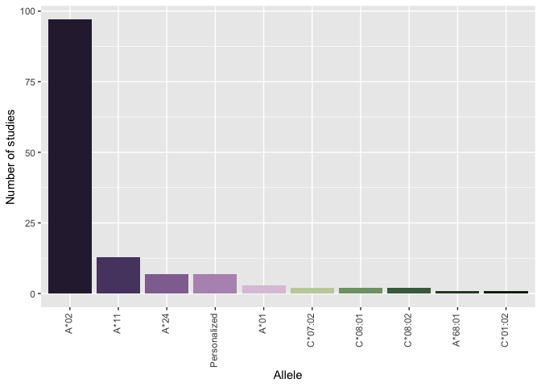

    library(ggplot2)
    library(magrittr)

    tc <- rio::import("./Data/CTG_studies.xlsx")
    tc[is.na(tc)] <- 0

    tc2<- tc[,-c(1,14,15)] %>% colSums() %>% as.data.frame()
    tc2 <- data.frame(V1 = rownames(tc2), value = tc2[,1])

    tc2.rm <- tc2[tc2$V1 %in% c("Not reported", "MHC-II"),]
    tc2.rm

    ##              V1 value
    ## 10 Not reported    10
    ## 12       MHC-II     1

    tc2 <- tc2[!tc2$V1 %in% c("Not reported", "MHC-II"),]
    levels <- tc2$V1[order(tc2$value, decreasing = T)]

    tc2$V1 <- factor(tc2$V1, levels=tc2$V1[order(tc2$value, decreasing = T)])

    p1 <- ggplot(tc2, aes(x=V1, y=value, fill=V1))+
      geom_col()+
      ylab("Number of studies")+
      xlab("Allele")+
      scale_fill_manual(values = MetBrewer::met.brewer("Cassatt2", 10))+
      theme(legend.position = "none", axis.text.x = element_text(angle=90, vjust=.3, hjust=1))

    p1

    pdf("./Figure_TCR_studies.pdf", height=3, width=4)
    print(p1)
    dev.off()

    ## quartz_off_screen 
    ##                 2
