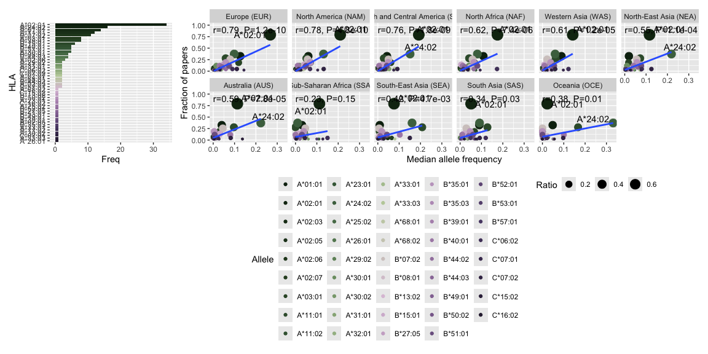

-   [Removed papers](#removed-papers)
-   [convert names](#convert-names)
-   [Freq others](#freq-others)
-   [Calculate ratios](#calculate-ratios)
-   [Plot MHC median vs ratio](#plot-mhc-median-vs-ratio)

    library(ggplot2)
    library(magrittr)
    library(tidyverse)

    ## ── Attaching core tidyverse packages ──────────────────────── tidyverse 2.0.0 ──
    ## ✔ dplyr     1.1.4     ✔ readr     2.1.5
    ## ✔ forcats   1.0.0     ✔ stringr   1.5.1
    ## ✔ lubridate 1.9.3     ✔ tibble    3.2.1
    ## ✔ purrr     1.0.2     ✔ tidyr     1.3.1
    ## ── Conflicts ────────────────────────────────────────── tidyverse_conflicts() ──
    ## ✖ tidyr::extract()   masks magrittr::extract()
    ## ✖ dplyr::filter()    masks stats::filter()
    ## ✖ dplyr::lag()       masks stats::lag()
    ## ✖ purrr::set_names() masks magrittr::set_names()
    ## ℹ Use the conflicted package (<http://conflicted.r-lib.org/>) to force all conflicts to become errors

    library(patchwork)
    library(tidytext)
    source("Utils.R")

    alleletop <- rio::import("./Data/Alleles_MostFreq_Continents.xlsx")
    alleletop$Allele <- paste0(alleletop$HLA, "*", alleletop$Name)
    studyids <- rio::import("./Data/StudyIDs.xlsx")

## Removed papers

    Database <- rio::import("./Data/Database_HLA_sysReview_jin.xlsx")
    nrow(Database)

    ## [1] 2134

    Database <- Database[-grep("/", Database$`HLA restriction`),]
    nrow(Database)

    ## [1] 1752

    Database <- Database[!Database$`HLA restriction` %in% "HLA class I",]
    nrow(Database)

    ## [1] 1507

    Database <- Database[!Database$`HLA restriction` %in% "A2",]
    Database <- Database[!Database$`HLA restriction` %in% "B35",]
    nrow(Database)

    ## [1] 1505

    Database <- Database[-grep("DRB1",Database$`HLA restriction`),]
    Database <- Database[-grep("DQB",Database$`HLA restriction`),]
    Database <- Database[-grep("DPB",Database$`HLA restriction`),]
    Database <- Database[-grep("DP",Database$`HLA restriction`),]
    Database <- Database[-grep("DR",Database$`HLA restriction`),]
    Database <- Database[-grep("HLA class II",Database$`HLA restriction`),]

    nrow(Database)

    ## [1] 907

    unique(Database$`HLA restriction`)

    ##  [1] "A*02:01" "A*30:01" "B*07:02" "A*11:01" "A*24:02" "A*26:01" "B*35:01"
    ##  [8] "A*33:03" "C*07:01" "B*57:01" "A*03:01" "B*15:01" "B*51:01" "B*44:03"
    ## [15] "A*01:01" "A*02:03" "B*44:02" "A*02:06" "A*68:01" "A*30:02" "A*02:07"
    ## [22] "C*07:02" "A*11:02" "C*06:02" "A*32:01" "A*33:01" "B*08:01" "B*40:01"
    ## [29] "A*31:01" "B*35:03" "A*29:02" "A*02:05" "B*39:01" "B*49:01" "B*53:01"
    ## [36] "B*27:05" "B*52:01" "A*25:02" "C*16:02" "A*23:01" "B*50:02" "B*13:02"
    ## [43] "C*15:02" "A*68:02"

## convert names

    references <- lapply(seq_along(Database$References), function(i){
    sx <- as.character(Database$References[i])
      out <- gsub("\\(","",sx) %>% gsub(pattern = ")", replacement = "") %>% strsplit(split = ";")
      
      out <- out[[1]]
      out
    }) %>% do.call(what=c) %>% unique()

    alleles <- unique(Database$`HLA restriction`)

    DB <-matrix(rep(0), ncol = length(alleles)+1, nrow = length(references))
    colnames(DB) <- c("Reference", alleles)
    DB <- as.data.frame(DB)
    DB[,1] <- references

    for(j in alleles){
      nms <- Database[Database$`HLA restriction` %in% j,7]
      nms <- gsub("\\(","",nms) %>% gsub(pattern = ")", replacement = "") %>% strsplit(split = ";")
      nms <- do.call(c, nms) %>% unique()
      DB[DB$Reference %in% nms,j] <-1
    }

## Freq others

    dx <- colSums(DB[,2:ncol(DB)])
    dx <- data.frame(HLA = names(dx), Freq=dx)
    dx <- dx[order(dx$Freq, decreasing = T),]
    dx$Ratio <- dx$Freq / nrow(DB)

    dx$HLA <- factor(dx$HLA, levels=dx$HLA[order(dx$Freq,decreasing = T)])

    data <- lapply(gsub("HLA-","", dx$HLA), getFrequency)
    data <- do.call(rbind, data)
    data$Perc_Allele <- as.numeric(data$`% of individuals that have the allele`)
    save(data, file="Data_AlleleFreq_sysRev.RData")

## Calculate ratios

    load("./Data/Data_AlleleFreq_sysRev.RData")

    data$AlleleFreq <- as.numeric(data$`Allele Frequency`)

    data.median <- data %>%
      group_by(Region, Allele) %>%
      summarise(Median = median(AlleleFreq, na.rm=T))

    ## `summarise()` has grouped output by 'Region'. You can override using the
    ## `.groups` argument.

    data.median$Ratio <- dx[match(data.median$Allele, dx$HLA),"Ratio"]

## Plot MHC median vs ratio

    dxf <- data.median[data.median$Allele %in% "A*02:01",]
    lvls <- dxf[order(dxf$Median,decreasing = T),drop=T,1]
    data.median$Region <- factor(data.median$Region, levels=lvls)

    data.median.mhc1 <- data.median[substr(data.median$Allele,1,2) %in% c("A*","B*","C*"),]

    cor.data <- lapply(unique(data.median.mhc1$Region), function(region){
      #region = data.median.mhc1$Region[1]
      
      subx <- data.median.mhc1[data.median.mhc1$Region %in% region,]
      cx <- cor.test(subx$Median, subx$Ratio)
      data.frame(region = region, cor = cx$estimate, 
                 lower = cx$conf.int[[1]], 
                 upper = cx$conf.int[[2]],
                 P = cx$p.value)
    }) %>% do.call(what=rbind)

    data.median.mhc1 <- data.frame(data.median.mhc1, 
                              cor.data[match(data.median.mhc1$Region, cor.data$region),])

    data.median.mhc1$label <- sprintf("r=%s, P=%s", 
                                      format(round(data.median.mhc1$cor,2 ),digits = 2),
                                      ifelse(data.median.mhc1$P <= 0.01, 
                                             format(data.median.mhc1$P, scientific = T, digits=2),
                                             round(data.median.mhc1$P,2)))

    data.median.mhc1$label[duplicated(data.median.mhc1$label)] <- NA

    dx$HLA <- gsub("HLA-","",as.character(dx$HLA))
    dx$HLA <- factor(dx$HLA, levels = dx$HLA[order(dx$Freq,decreasing = F)])

    p1  <- ggplot(dx[dx$HLA %in% data.median.mhc1$Allele,], aes(x=HLA, y=Freq, fill=HLA))+
      geom_col()+
      theme(legend.position = "none")+
      scale_fill_manual(values = MetBrewer::met.brewer("Cassatt2",44))+
      coord_flip()

    p2 <- ggplot(data.median.mhc1, aes(x=Allele, y=Median, fill=Region))+
      geom_col(position = "dodge")+
      scale_fill_manual(values = MetBrewer::met.brewer("Cassatt2", 11))+
      ylab("Percentage ")+
      theme(legend.position = "bottom")+
        theme(axis.text.x=element_text(angle=90, vjust=.3, hjust=1))+
      geom_vline(xintercept=seq(1.5, length(unique(data.median.mhc1$Allele))-0.5, 1), 
                 lwd=1, colour="white")+
      theme(panel.grid.major.x = element_blank(), panel.grid.minor.x = element_blank())
    p3 <- ggplot(data.median.mhc1, aes(x=Median, y=Ratio))+
        geom_point(aes(size=Ratio, col=Allele))+
        ggrepel::geom_text_repel(aes(label = Allele))+
        facet_wrap(~Region, ncol=6)+
        ylim(0,1)+
        xlab("Median allele frequency")+
        ylab("Fraction of papers")+
        geom_text(aes(x=0,y=.9, label=label), hjust=0)+
        geom_smooth(method=lm,se=F)+
        theme(legend.position="bottom")+
        scale_colour_manual(values = rev(MetBrewer::met.brewer("Cassatt2",44)))

    p1+p3+plot_layout(width = c(0.2,0.8))

    ## `geom_smooth()` using formula = 'y ~ x'

    ## Warning: Removed 1 row containing non-finite outside the scale range
    ## (`stat_smooth()`).

    ## Warning: Removed 1 row containing missing values or values outside the scale range
    ## (`geom_point()`).

    ## Warning: Removed 1 row containing missing values or values outside the scale range
    ## (`geom_text_repel()`).

    ## Warning: Removed 466 rows containing missing values or values outside the scale range
    ## (`geom_text()`).

    ## Warning: Removed 1 row containing missing values or values outside the scale range
    ## (`geom_smooth()`).

    ## Warning: ggrepel: 43 unlabeled data points (too many overlaps). Consider
    ## increasing max.overlaps

    ## Warning: ggrepel: 37 unlabeled data points (too many overlaps). Consider
    ## increasing max.overlaps

    ## Warning: ggrepel: 43 unlabeled data points (too many overlaps). Consider
    ## increasing max.overlaps

    ## Warning: ggrepel: 42 unlabeled data points (too many overlaps). Consider increasing max.overlaps
    ## ggrepel: 42 unlabeled data points (too many overlaps). Consider increasing max.overlaps

    ## Warning: ggrepel: 43 unlabeled data points (too many overlaps). Consider increasing max.overlaps
    ## ggrepel: 43 unlabeled data points (too many overlaps). Consider increasing max.overlaps

    ## Warning: ggrepel: 42 unlabeled data points (too many overlaps). Consider
    ## increasing max.overlaps

    ## Warning: ggrepel: 43 unlabeled data points (too many overlaps). Consider
    ## increasing max.overlaps

    ## Warning: ggrepel: 41 unlabeled data points (too many overlaps). Consider
    ## increasing max.overlaps

    ## Warning: ggrepel: 42 unlabeled data points (too many overlaps). Consider
    ## increasing max.overlaps

